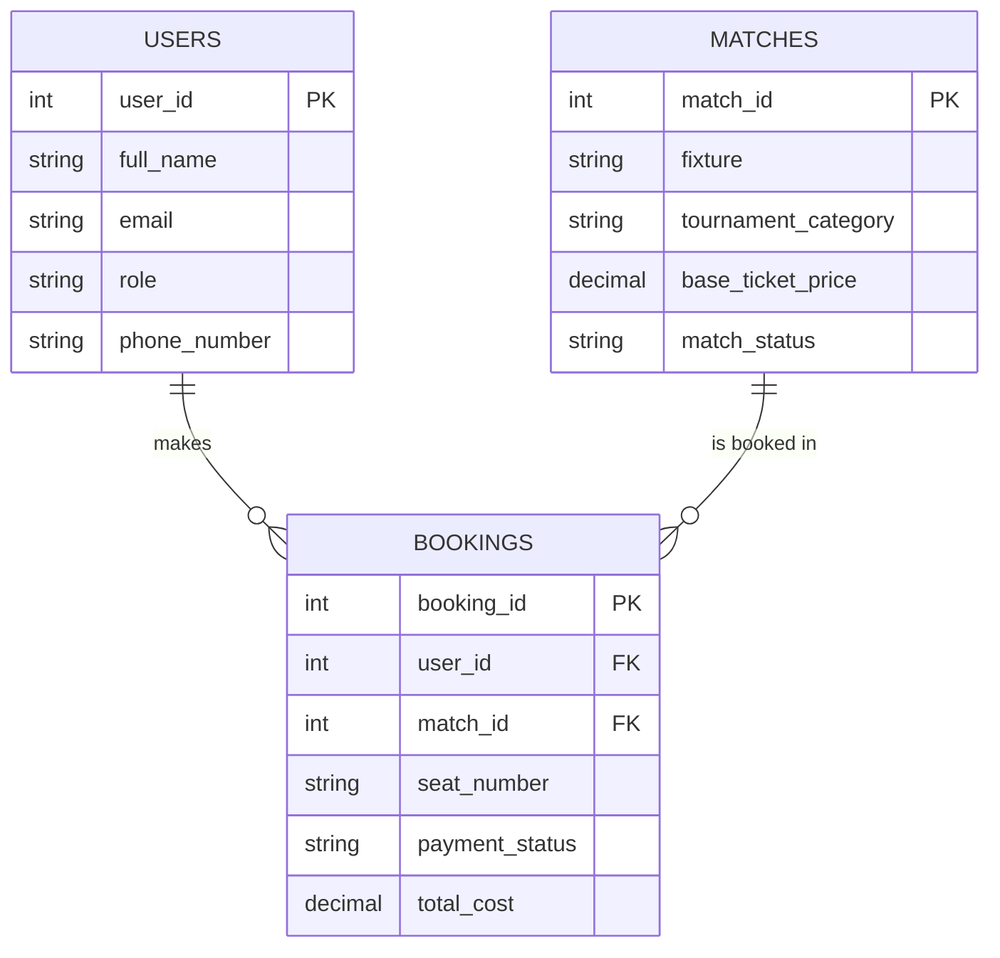

# Football Ticket Booking System — ERD

## Relationships

- **USERS → BOOKINGS**: One-to-Many — one user can make many bookings
- **MATCHES → BOOKINGS**: One-to-Many — one match can have many bookings
- Each row in **BOOKINGS** links exactly one user to one match for one seat

```
USERS    ||--o{  BOOKINGS   : "makes"
MATCHES  ||--o{  BOOKINGS   : "is booked in"
```

## Tables

### USERS

| Field | Type | Key | Description |
|---|---|---|---|
| user_id | INT | PK | Unique identification number for each registered user |
| full_name | VARCHAR | | First and last name of the user |
| email | VARCHAR | | User's email address used for login |
| role | VARCHAR | | 'Ticket Manager' or 'Football Fan' |
| phone_number | VARCHAR | | Contact mobile number of the fan |

### MATCHES

| Field | Type | Key | Description |
|---|---|---|---|
| match_id | INT | PK | Unique identification number for each football match |
| fixture | VARCHAR | | e.g. 'Real Madrid vs Barcelona' |
| tournament_category | VARCHAR | | e.g. 'Champions League' |
| base_ticket_price | DECIMAL | | Foundational price for a single standard entry seat |
| match_status | VARCHAR | | 'Available', 'Selling Fast', 'Sold Out', or 'Postponed' |

### BOOKINGS

| Field | Type | Key | Description |
|---|---|---|---|
| booking_id | INT | PK | Unique tracking number for the ticket purchase |
| user_id | INT | FK → USERS.user_id | Links the booking to the user who made the purchase |
| match_id | INT | FK → MATCHES.match_id | Links the booking to the match being attended |
| seat_number | VARCHAR | | e.g. 'A-12' |
| payment_status | VARCHAR | | 'Pending', 'Confirmed', 'Cancelled', or 'Refunded' |
| total_cost | DECIMAL | | Final invoice price based on base price and seat quantity |

## Diagram (Mermaid)



> GitHub renders Mermaid code blocks natively, so this diagram will display automatically when viewed in the repo.

## Notes

- Crow's Foot notation: a single tick marks the "one" side (USERS, MATCHES), and a crow's foot marks the "many" side (BOOKINGS).
- Foreign keys in **BOOKINGS** enforce referential integrity — a booking cannot reference a `user_id` or `match_id` that doesn't exist in the parent tables.